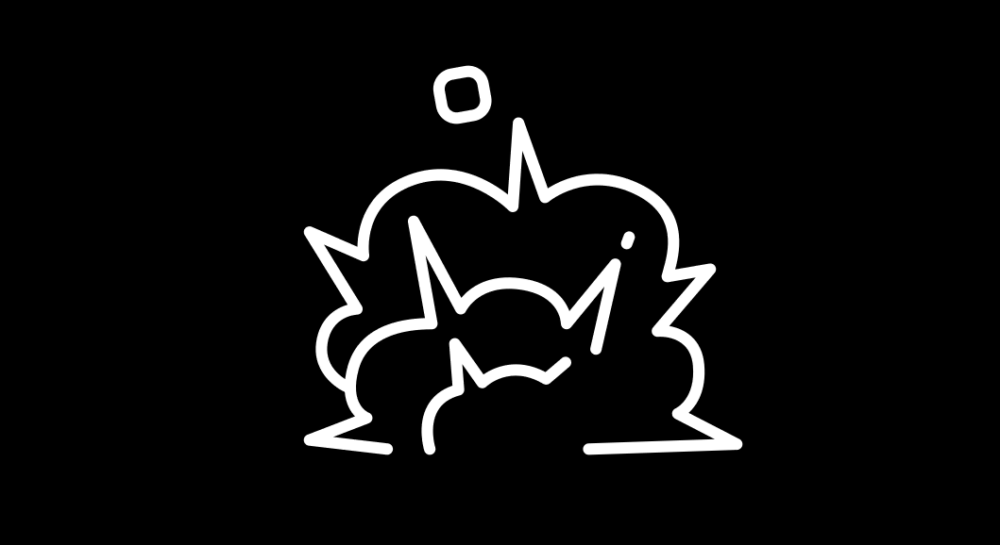

# ANOA ONLINE

<figure><figcaption></figcaption></figure>

## 0. 다운로드

#### ANOA Download Link



## 1. 개요 


ANOA 시네마틱


SSAFY 7기 자율프로젝트 2반 1팀 **\[아무튼노는거아님]**이 만든 3인칭 액션 게임이다.

빠른 속도감과 전략적 요소가 특징으로 한국어를 지원한다.

## 2. 스토리


2077년 모종의 사건을 계기로 여러 차원의 핵이 흩어지며 시공간이 뒤틀리기 시작한다.

각 세계에서는 자신의 차원의 붕괴를 막기 위해 요원들을 소집하기 시작했다.

자신의 차원을 지키기 위해 싸워 핵을 쟁취해야만 한다.


## 3. 조작법

* **W, A, S, D :** 이동
* **Space : 점프**
* **왼쪽 Shift :** 대쉬 - 지상 / 공중에서 누를 시 일정 거리를 대쉬한다. 재사용 대기 시작은 3초로 매우 짧은 편에 속한다.
* **Tab :** 전력질주 - 달리기와 전력질주를 바꿀 수 있다. 상태에 따라 발소리가 다르게 나므로 이를 이용한 전략적 플레이가 가능하다.
* **왼쪽 Ctrl, C :** 웅크리기 - 평면 또는 경사면에서 이동 중에 누를 시 슬라이딩을 한다.
* **마우스 좌클릭 :** 기본 공격 - 칼을 휘둘러 전방을 공격한다. 상대방이 맞을 시 짧은 시간 경직에 걸린다.
* **마우스 우클릭 :** 사격 - 전방에 총을 발사한다. 총알이 탄착한 곳에 있는 적에게 경직을 부여한다.
* **Q, E :** 스킬 사용 - 그래플링, 범위 공격 등의 스킬을 사용한다. 스킬은 요원에 따라 달라진다.
* **좌 상단 **~~**숫**~~**자패드 1,2 :** 핑 시스템 - 훈련장을 제외한 모드에서 사용할 수 있는 핑 시스템. 게임의 상황을 아군에게 알릴 수 있다.
* **F1 :** 내가 사용하고 있는 요원의 스킬 설명을 확인할 수 있다.
* **F2, F3 :** 감정표현 : 지속적으로 해당 키를 눌러 감정표현을 사용할 수 있다.

* **조작 팁**
  * **벽 달리기 :** 공중에서 벽을 비스듬히 달리면 벽을 수평으로 달릴 수 있다. 속도가 전력질주보다 빠른 편이므로 유용하게 사용할 수 있다.
  * **올라가기 :** 캐릭터가 올라갈 수 있는 턱이 있다면 화면 중앙에 UI가 생기고, 이때 space를 눌러 올라갈 수 있다. 높이가 조금 부족한 경우 사용해 평소에 올라가지 못했던 곳도 올라갈 수 있다.
  * **슬라이딩 :** 내리막 길 경사면에서 사용할 경우 평소보다 오래  지속되며  달리는 것보다 빠르게 갈 수 있다.

## 4. 게임모드

현재까지 추가된 게임모드로 2가지가 있다.

### 4.1. 깃발 뺏기 (Capture The Flag)

**ANOA**의 가장 메인 모드이다.

기본적인 깃발 뺏기 룰과 유사하며 맵의 랜덤 지역에서 스폰되는 오브(깃발)을 상대 팀보다 빠르게 회수해&#x20;

내 지역으로 가져오면 점수를 획득한다.

상세 규칙

1. 모든 플레이어가 접속 한 뒤 30초 뒤 게임이 시작된다.
2. 게임이 시작되고 맵의 특정 지역에서 랜덤으로 오브 (깃발)이 생성된다.
3. 해당 오브(깃발)을 가지고 내 지역으로 돌아올 경우 1점을 획득한다.
4. 2점을 모을 경우 승리 오브(깃발)이 맵 중앙에서 생성되며 이를 옮길 수 있는 권한이 부여된다.
5. 해당 승리 오브 (깃발)을 본인 지역으로 가지고 오면 게임을 승리한다.

#### 플레이 팁

* **오브**

게임이 시작되고 오브(깃발)의 위치는 상단의 네비게이션을 통해 파악이 가능하다.

<figure><figcaption>
오브(깃발)의 위치 파악
</figcaption></figure>

오브(깃발)에 가까이 왔다면, 오브(깃발)의 실루엣을 통해 어디에 있는지 정확하게 파악할 수 있다.

<figure><figcaption>
오브(깃발)의 위치
</figcaption></figure>

* **RED TEAM / BLUE TEAM**

오브(깃발)과 마찬가지로 네비게이션을 통해 방향을 쉽게 파악할 수 있고, 거리가 가까울 경우 실루엣을 통해 위치를 파악할 수 있다.

또한 발 밑의 색을 통해 현재 내가 어떤 팀에 속해있는지 알 수 있다.

<figure><figcaption>
레드팀과 레드팀 득점 구역
</figcaption></figure>

#### 4.1.1. SSAFY Research Center

<figure><figcaption></figcaption></figure>

강의동과 SSAFY Research Center, 절벽에서 랜덤으로 오브(깃발)이 생성되며,

최종 깃발은 무조건 SSAFY Research Center에서만 생성된다.

### 4.2. 훈련장 (SSAFY Training Center)

<figure><figcaption></figcaption></figure>

<figure><figcaption></figcaption></figure>

게임의 룰에 관계없이 자유롭게 활동하며 연습할 수 있는 공간이다.

멀티플레이를 지원하기 때문에 다른 사람들과 연습을 하거나, 소통할 수 있는 공간으로도 활용할 수 있다.

## 5. 캐릭터 (요원)

### 5.1. 체이서

<figure><figcaption></figcaption></figure>

뛰어난 기동성과 넓은 범위에 피해를 입힐 수 있는 기술을 가지고 있으며 오브를 쫓거나 먼저 선점하는데 특화되어 있다.

* **스킬**

| .png>) | 플레이어가 바라보는 방향으로 짧은 거리를 빠르게 이동합니다.                                |
| ------------------------------------- | ---------------------------------------------------------------- |
| .png>)  | 플레이어의 조준선을 기준으로 그래플을 날립니다. 구조물에 적중하면 그래플 방향으로 빠른 속도로 이동합니다.      |
|         | 지면을 강하게 내리 찍어 주위의 플레이어를 밀쳐내고 스턴상태로 만듭니다. 공중에서 시전 시 바로 땅으로 이동합니다. |

### 5.2. 러너

<figure><figcaption></figcaption></figure>

상대방의 시야를 가릴 수 있고 상태 이상 면역 스킬을 가졌으며 오브 운반과 난전에 특화되어 있는 캐릭터입니다.

* **스킬**

| .png>) | 플레이어가 바라보는 방향으로 짧은 거리를 빠르게 이동합니다.                  |
| ------------------------------------- | -------------------------------------------------- |
| .png>) | 플레이어 조준선을 기준으로 섬광탄을 발사하여 범위 안의 플레이어에게 섬광효과를 부여합니다. |
| .png>) | 주위의 적을 밀쳐내고 5초동안 상태이상에 면역이 됩니다.                    |

## 6. 패치 내역

* 2022-11-16 \[v0.2] 클로즈베타 시작
* 2022-11-18 \[v1.0] 오픈 베타 시작
* 2022-11-22 \[v1.0] 서비스 점검
* 2022-11-23 \[v1.3.3] 버전 업데이트
  * 업데이트\
    \- 인게임 캐릭터 위에 이름 표기\
    \- 빠른 대전 사용 가능\
    \- 사용자 대전 인원 제한 해제
  * 버그 수정\
    \- 인게임 채팅시 스킬이 사용되는 현상 수정\
    \- 인게임 채팅시 빈칸이 입력되는 현상 수정\
    \- 시점 분리 버그 수정\
    \- 튜토리얼 맵 경고문 버그 수정\
    \- 튜토리얼 출구에서 발생하는 로고 버그 수정
* 2022-11-23 \[v1.4] 본선 시연용 업데이트 버전
  * 업데이트\
    \- 매치메이킹 서버 안정화  \
    \- 로딩 화면 수정\
    \- 튜토리얼 맵 수정\
    \- \[체이서] 캐릭터 스킬 쿨타임 조정\
    \- \[러너] 캐릭터 스킬 쿨타임 조정

## 7. 버그 리포트 및 요청사항

* 2022-11-18 v1.0
  * ~~시점 분리 버그 (서정욱 실습코치님 제보)~~\
    ~~Development Server/Editor 빌드 후  exe 실행시 backtic(\`) 누르면 콘솔창 등장. 특정 키를 함께 누를 경우 디버그 모드로 진입하면서 캐릭터와 시점창이 분리~~
  * 방 채팅 리셋 버그 (서정욱 실습코치님 제보)\
    누군가 팀을 이동하는 경우에 채팅창에서 작성중이던 키보드 포커스가  사라지는 버그
  * ~~인게임 채팅 관련 요청   (서정욱 실습코치님)~~\
    ~~빈칸 채팅이 올라오거나 채팅 상태를 구분하기 어렵다~~
  * 그래플 벽 버그 (서정욱 실습코치님 제보)\
    그래플 사용후 벽 뒤에 숨으면 그래플이 끊어지지 않고 끌려가는 버그
  * ~~튜토리얼 맵 경고문알림 버그 (서정욱 실습코치님 제보)~~\
    ~~좌측 상단 'TEXTURE STREAMING POOL OVER 56.052 MiB BUDGET" 발생.~~\
    ~~그래픽이나 에셋이 최적화되지 않았다는 경고문~~구
  * ~~인게임 인원 제한 해제 요청  (서정욱 실습코치님)~~
  * ~~튜토리얼 탈출시 로고 버그 (서정욱 실습코치님 제보)~~\
    ~~튜토리얼 탈출구에 근접하면 나타나는 게임로고가 다시 튜토리얼 방으로 돌아와도 여전히 띄워지는 버그~~
  * ~~소켓 연결 버그~~\
    ~~연속으로 빠른 대전을 2회 이상 매칭하는 경우 발생하는 소켓 프로그램 종료 버그~~
* 2022-11-23 v1.4
  * 소켓 인식 버그\
    엄청난 속도로 마우스   클릭  반복시, 소켓이 클릭 속도를 따라가지 못하고 플레이어의 위치를 잘못 인식함

## 8. 여담
